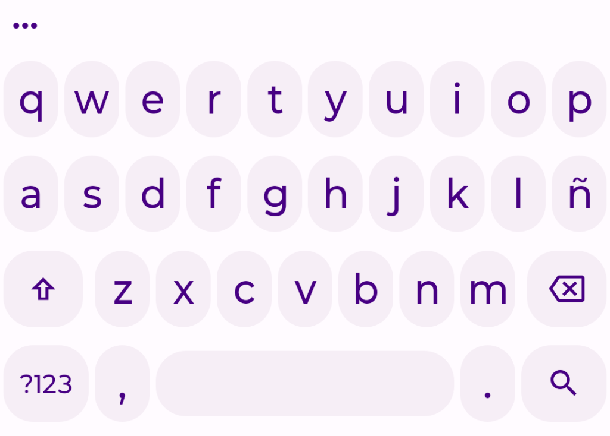
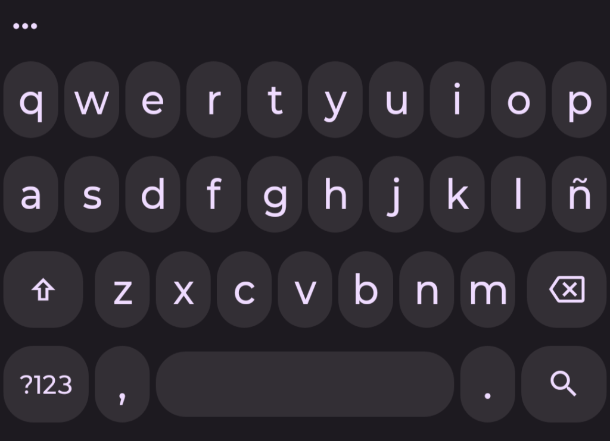
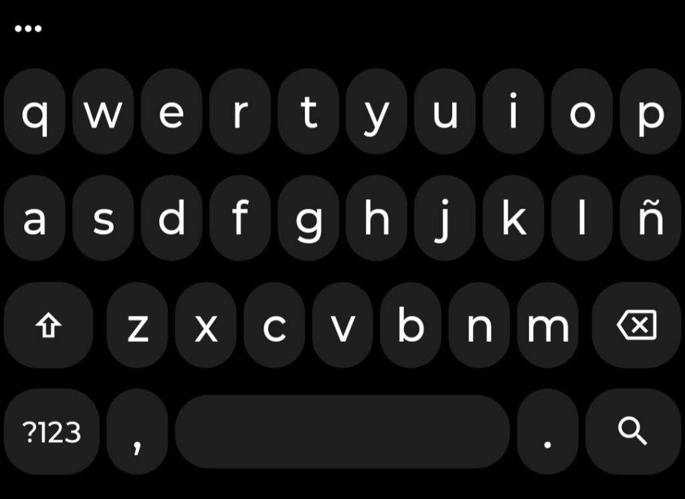
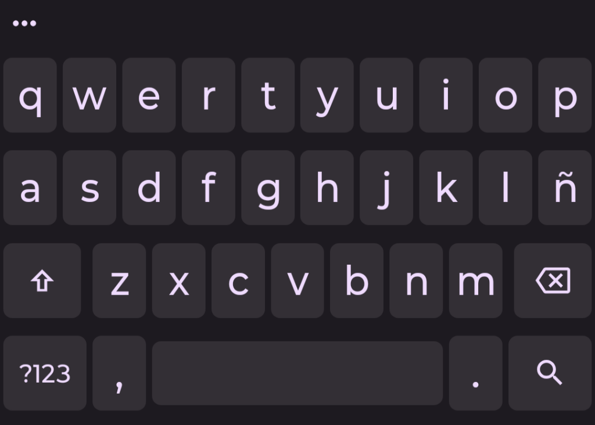
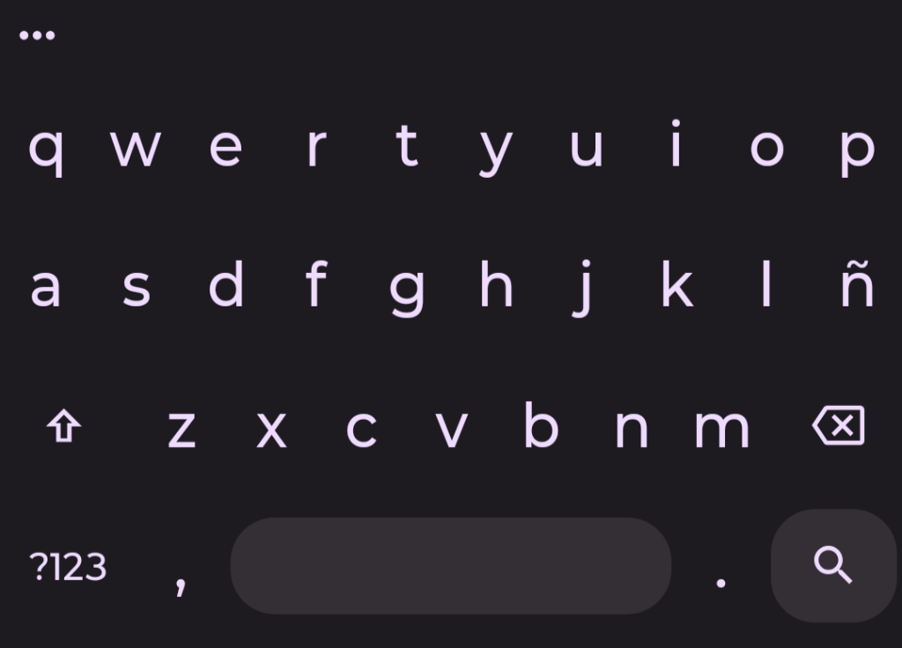

<div align="center">

# Simple Keyboard

[](https://github.com/soyelmismo/simple-keyboard/releases/latest)
[](https://github.com/soyelmismo/simple-keyboard/releases)
[](https://github.com/soyelmismo/simple-keyboard/stargazers)
[](LICENSE)
[](https://android.com)
[](#about)

**Private, zero-allocation open-source Android keyboard.**  
*Forked from [rkkr/simple-keyboard](https://github.com/rkkr/simple-keyboard) / [AOSP LatinIME](https://android.googlesource.com/platform/packages/inputmethods/LatinIME/)*

[Themes & Key Shapes](#themes--key-shapes) • [Key Features](#key-features) • [Benchmarks & Performance](#benchmarks--performance) • [Privacy & Permissions](#privacy--permissions) • [Tech Stack](#tech-stack--versions) • [Downloads](#downloads) • [Build Instructions](#build-instructions) • [Maintainers](#maintainers) • [Credits](#credits)

</div>

## About

Simple Keyboard is an Android keyboard based on [rkkr/simple-keyboard](https://github.com/rkkr/simple-keyboard) and AOSP LatinIME. It has a ~2MB package size, zero-allocation native inference, and low battery consumption.

## Themes & Key Shapes

Material You themes and key geometry styles:

### Dynamic Color Palettes

| **Monet Light** | **Monet Dark** | **AMOLED Black** |
| :---: | :---: | :---: |
|  |  |  |
| *Lavender palette with high-contrast glyphs* | *Slate palette for low-light use* | *Pure `#000000` dark mode for OLED screens* |

### Key Geometry & Styles

| **Pill / Capsule** | **Rounded Rectangle (Squircle)** | **Keyless / Borderless** |
| :---: | :---: | :---: |
|  |  |  |
| *Material You pill geometry* | *Squircle shape with distinct borders* | *Flat layout without key borders* |

### Key Features

**Performance & Neural Core**
- **Footprint:** ~2MB package size.
- **TRF2 BitNet 1.58-bit Neural Engine:** Native C++ ternary text prediction model.
- **Zero-allocation Tokenization:** SIMD-unrolled matrix operations with no GC pauses on hot paths.

**Typing & Gestures**
- **Space Swipe:** Drag across the spacebar to move the cursor.
- **Delete Swipe:** Drag left from backspace to delete words.
- **Swipe Sensitivity:** Adjustable gesture thresholds.
- **Number Row:** Optional dedicated number row.
- **Auto-Correction:** Configurable text correction, capitalization, and double-space period.

**Clipboard & Suggestions**
- **Clipboard History:** SQLite store to pin, search, and manage clips.
- **Image Suggestions:** Paste recent screenshots and images from the suggestion strip.

**Customization & Dictionaries**
- **Themes:** Material You dynamic colors, Light, Dark, AMOLED Black, and System Default.
- **Adjustable Dimensions:** Independent height and bottom offset for portrait and landscape.
- **Emoji Picker:** Integrated emoji panel.
- **External Dictionaries:** Import `.dict`, `.bin`, and custom TRF2 models.
- **Backup & Restore:** Export and import settings and user dictionary words as JSON.

## Benchmarks & Performance

Measurements taken under zero-allocation constraints:

| Metric | Measured Value | Implementation Detail |
| :--- | :--- | :--- |
| **RAM (Active Typing)** | **~18 MB PSS** | Flat primitive arrays and compact in-memory trie indexes. |
| **RAM (Background/Idle)** | **~5 MB PSS** | Ephemeral caches released when keyboard is hidden. |
| **CPU (Continuous Typing)** | **< 0.2%** | No background threads, SIMD matrix math, zero GC allocations. |
| **Keyboard Open Latency** | **< 12 ms** (Cold) / **< 3 ms** (Warm) | Pre-inflated views and compact XML layouts. |
| **TRF2 Neural Inference** | **< 1 µs** (0.0006 ms / pass) | 2-bit packed weights (`BitNet 1.58b`) with unrolled SIMD dot products. |
| **Full Pipeline Latency** | **~3–5 ms** | End-to-end touch spatial scoring, trie search, and candidate ranking. |
| **Inference Throughput** | **> 1,500,000 passes/sec** | Single-pass matrix-vector product without heap allocations. |
| **Frame Drop Rate** | **0.0%** | 60 FPS / 120 FPS rendering during typing. |
| **Network Traffic** | **0 KB** | No internet permission and no background analytics. |
| **Package Size** | **~2.06 MB APK** | Native binary without webviews or tracking libraries. |

### Privacy & Permissions

Simple Keyboard does not request internet permission and does not store or transmit user data.

**Permissions:**
- `VIBRATE`: Keypress haptic feedback.
- `READ_MEDIA_IMAGES` / `READ_EXTERNAL_STORAGE`: Optional. Displays recent screenshots and images in the suggestion strip.

### Excluded Features

Omitted by design to maintain zero heap allocations and low memory use:
- GIFs
- Gesture / swipe typing
- Cloud sync and analytics
- Ads

## Tech Stack & Versions

- **Language:** Java 21 & Native C++ (Inference Engine)
- **Android SDK:** API 37 (Target & Compile), API 23 (Min)
- **Build System:** Gradle 9.3.1

## Downloads

Download the latest APK release from [GitHub Releases](https://github.com/soyelmismo/simple-keyboard/releases/latest).

## Build Instructions

Build from source with the Gradle wrapper:

```bash
./gradlew testDebugUnitTest assembleDebug assembleRelease
```

## Maintainers
- **[kveld9](https://github.com/kveld9)**
- **[soyelmismo](https://github.com/soyelmismo)**

## Credits

Licensed under the **Apache License Version 2.0**.

Based on [rkkr/simple-keyboard](https://github.com/rkkr/simple-keyboard), derived from [AOSP LatinIME](https://android.googlesource.com/platform/packages/inputmethods/LatinIME/).

